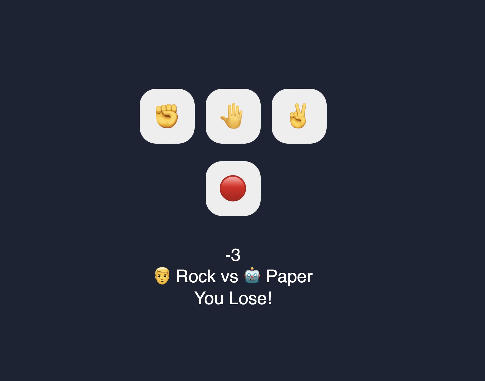

# Rock Paper Scissors Game
In this python project, we will build a Rock Paper Scissors Game application. It will be 3 tier application,
1. Front end: UI is written in HTML/CSS/Bootstrap
2. Backend: Python and Flask
3. Database: Replit's database

